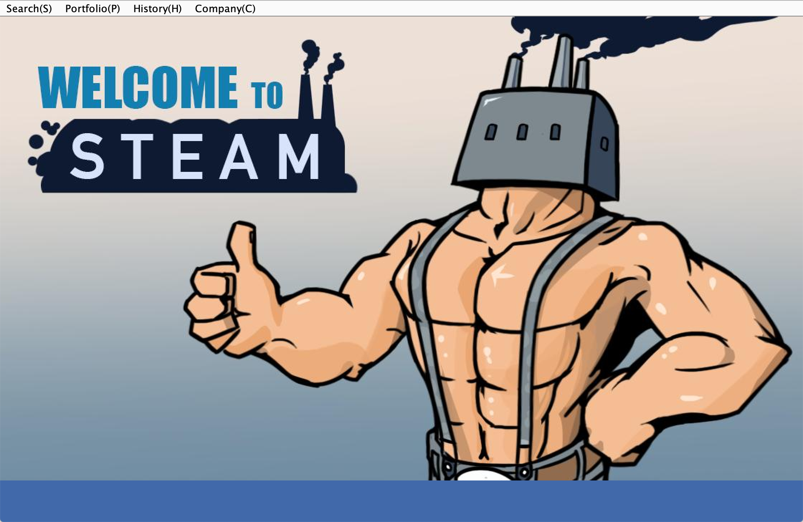
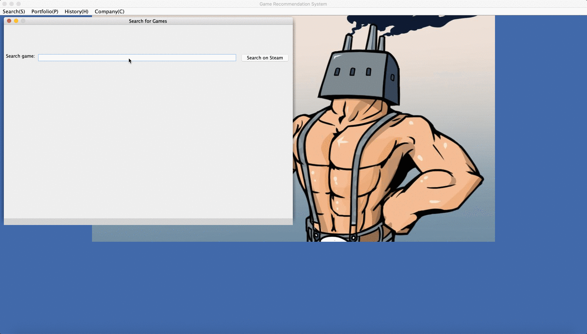
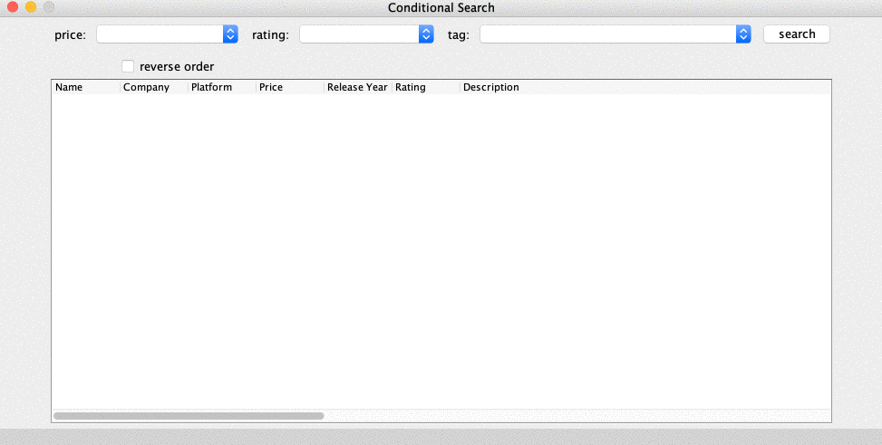
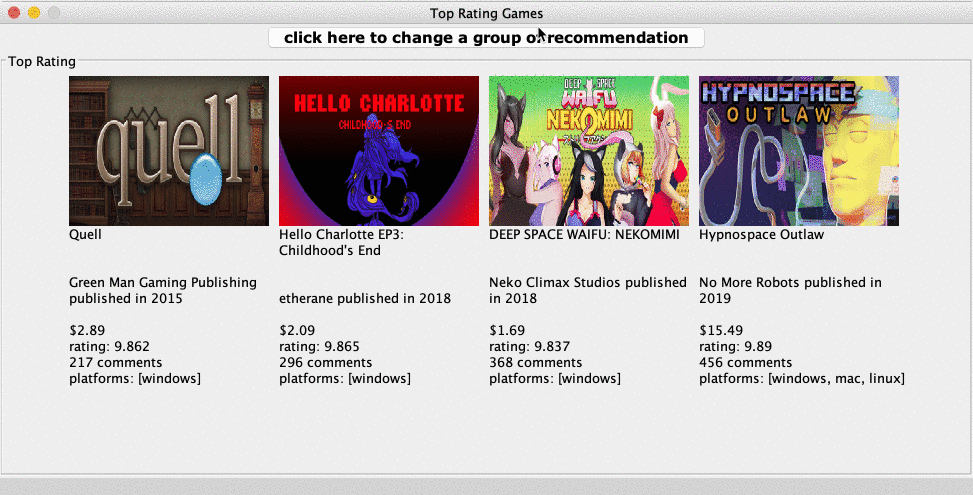
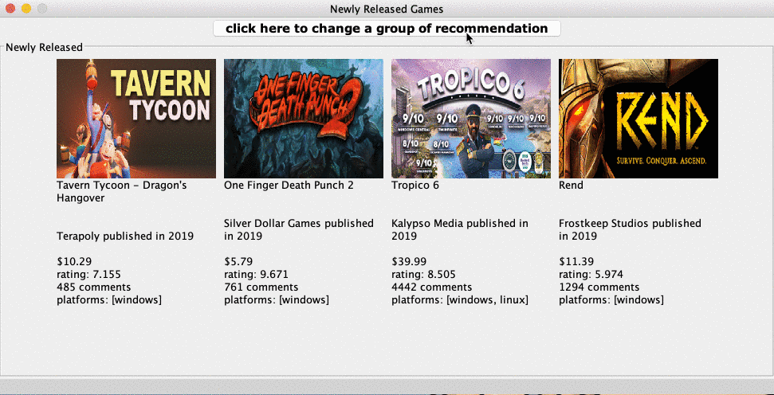
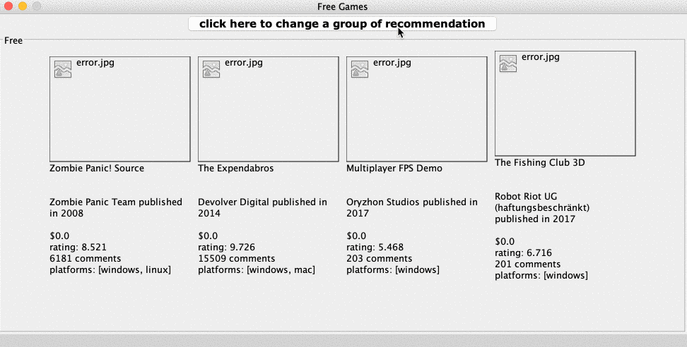
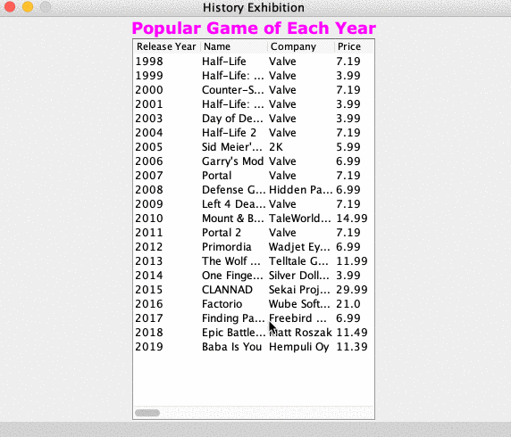
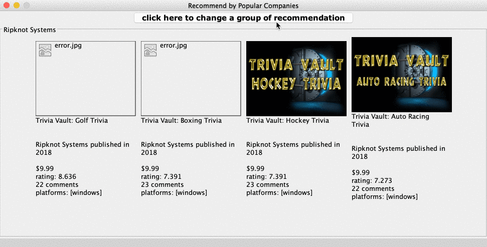

# Game Recommendation System

By Fan Yi, Tong Fu, Hanye Wang

## Introduction



Finding a game that fits your mind is not an easy task. This game recommendation application aims to help you solve this tricky issue. It collects information of tons of game in steam, including their names, companies, release date, price, rating, description, etc, and the users can customize the filters to find the ideal game(s), and get more information about the game they are looking for.

Major **data structures** used in this project: Trie, ArrayList, HashMap, TreeMap, SortedMap, TreeSet, HashSet.

**Data** used in this project: Company.csv (12432 items), Game.csv (22465 items), GameTag.csv (64707 items)

***

## How to run

Download the code (.zip), and you can access the user interface in either ways:

1. run in command line - get the path of GameRecommendation.java

    ```java path```

2. run in Java IDEs - run /src/gui/GameRecommendation.java

## Code structure

Package 1: autocomplete - autocomplete in search box

Package 2: constant

Package 3: game - indexing and sorting

Package 4: gui - the graphic user interface

Package 5: helper - helper function for .csv reading

Package 6: test

## User Interface and Featured Functions

1. Search

   * General Search

     Implemented autocomplete for search in the database. The user will be directed to the Steam game page for the game he/she searches after clicking the search button.

     

   * Conditional Search

     The user is able to filter based on the price, rating, and tag. Results will be displayed in the order of rating (highest on top), and if there is a tie, the second comparison will be made based off of the price. There is also a reverse order option.

     

2. Portfolio

   * Top Rating

     The game recommendation system will randomly choose four games (as a group) to display. Price, ratings, # of comments, platforms, and released year will be shown below a figure of the game (if there is no available figure, an error image will be the replacement).

     

   * Newly Released

     The game will be sorted based on the release year. Four as a group of recommendations is available. 

     

   * Free

     An option that will randomly pick four as a group of recommendated games that is for free. 

     

3. History

   This pane will generate a tabulated list of games that is the most popular in year from 1998 to 2019. The release year, name, company, price, rating, and a short description will be displayed. 

   

4. Company

   This option generates games from popular companies (sorted by number of ratings). All four games shown in one group are from the same company.

   

## Future improvements

1. Add a clear option that will refresh the search.
2. The search panel cannot be easily moved around within the game recommendation system window. 
3. Allow for multiple choice selection in conditional search.
4. Combined duplicate company/game to have a more accurate recommendation.
5. ... to be continued!

